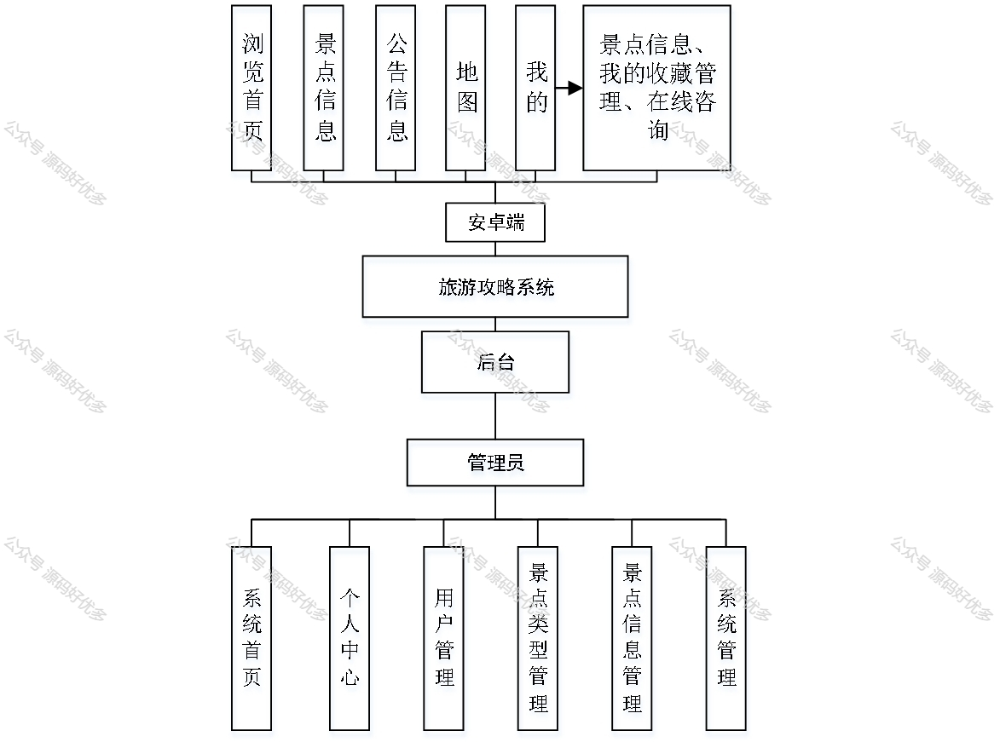
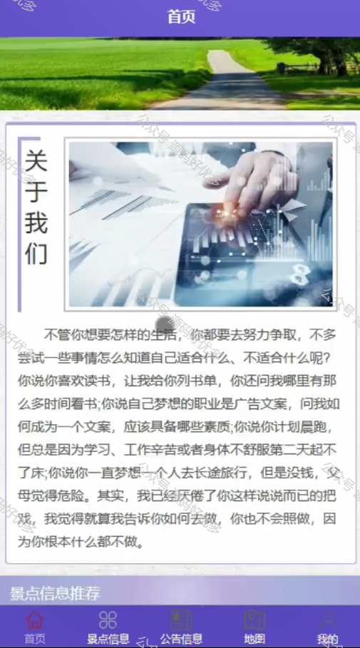
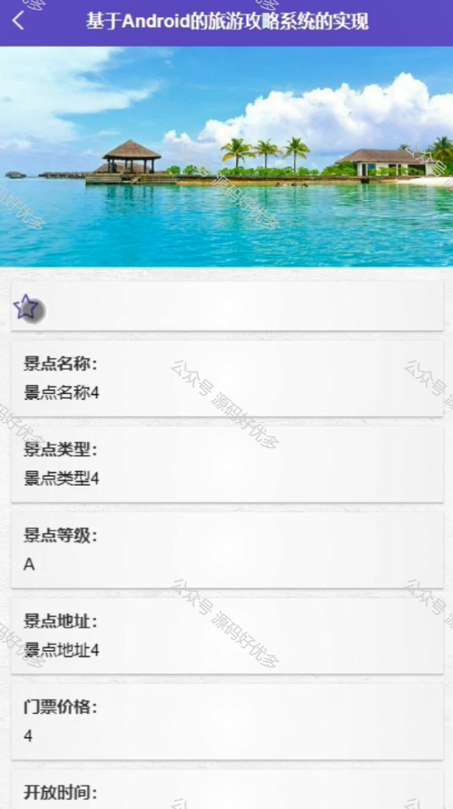
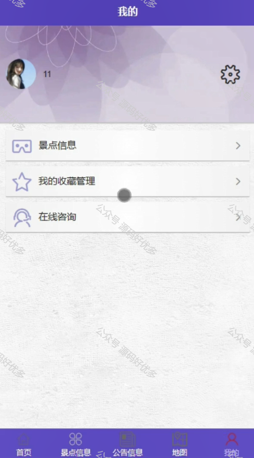
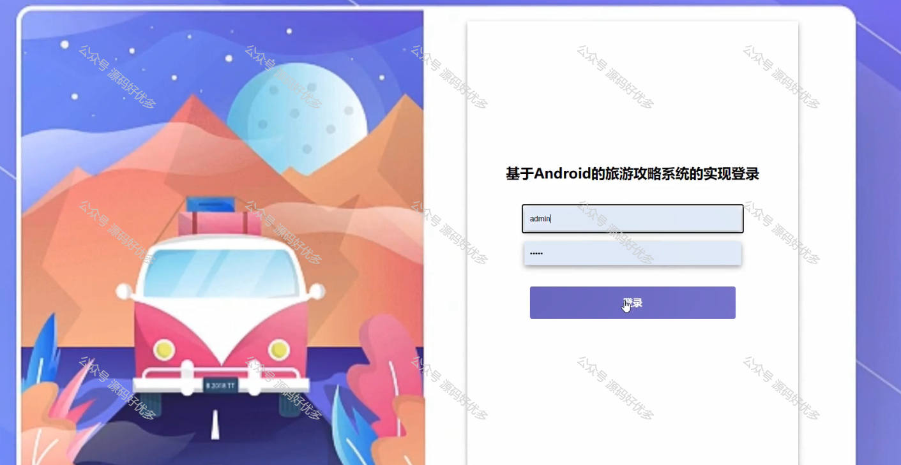
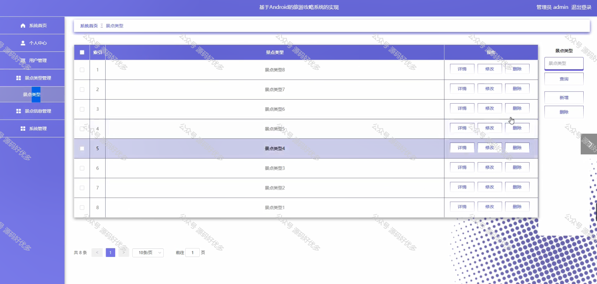
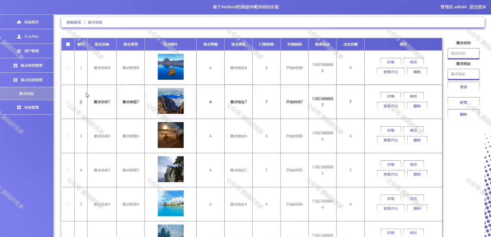
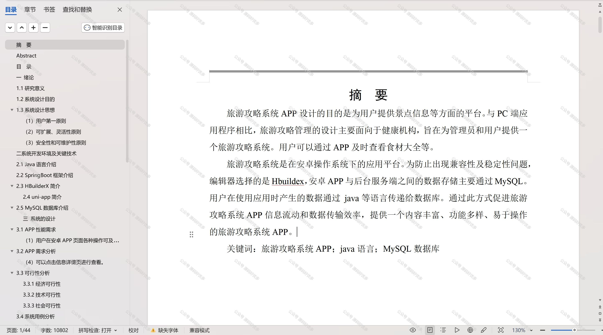

 
## 查看主页获取源码

> **作者介绍**： **✌**全网粉丝10W+本平台特邀作者、博客专家、CSDN新星计划导师、java领域优质创作者,博客之星、掘金/华为云/阿里云/InfoQ等平台优质作者、专注于项目实战 **✌**

  

### 一、作品包含

源码+数据库+设计文档万字+PPT+全套环境和工具资源+部署教程

### 二、项目技术

前端技术：Html、Css、Js、Vue、Element-ui

数据库：MySQL

后端技术：Java、Spring Boot、MyBatis

  

### 三、运行环境

开发工具：IDEA/eclipse + 微信开发者工具

数据库：MySQL5.7

数据库管理工具：Navicat10以上版本

环境配置软件： JDK1.8+Maven3.6.3

前端Nodejs：14

### 四、项目介绍
项目编号：mpweixinA041

旅游攻略小程序立足于我国广阔的地理景观和深厚的文化底蕴，旨在为广大旅行爱好者提供一个全面、便捷的在线旅游指南平台。通过整合各地旅游资源，小程序为用户提供了详尽的景点介绍、实时的路线导航、特色美食推荐以及个性化的行程规划，使得探索陌生城市变得更加轻松愉快，同时也促进了旅游业的数字化转型和可持续发展。

前台用户功能：浏览首页、景点信息、公告信息、地图、我的收藏管理、在线咨询。

后台管理员的功能：系统首页、个人中心、用户管理、景点类型管理、景点信息管理、系统管理。

### 五、运行截图

  
